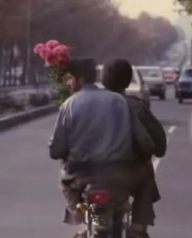

---
title: 关于
date: 2025-04-14 15:00:00
layout: page
type: about
top_img: false
avatar: /images/avatar.jpg
---

# 关于我

  
  

    <h2>Hushhh</h2>
    
vibe coder | ZJU | 记录学习、研究和生活的小站

  

## 简介

你好，欢迎来到我的个人网页。这里会记录我在学习、科研、编程和日常生活中的笔记与思考。

我希望这个小站更像一个长期维护的知识库：不只放结果，也保留探索过程、踩坑记录、工具配置和阶段性的想法。

## 关注方向

- 机器学习与医学影像
- 数据分析与可视化
- Web 与小程序开发
- 学习方法、科研训练和个人知识管理
- 游戏、生活和一些碎碎念

## 当前状态

我要读博啦。接下来会把更多读博准备、科研训练、论文阅读和实验记录整理到这里。

## 技能与工具

  Python
  Machine Learning
  Data Analysis
  Hexo
  JavaScript
  Markdown

## 项目与记录

  

    <strong>2026 - 现在</strong>
    
整理个人网页，把博客改造成更适合长期记录的学习和科研空间。

  

  

    <strong>2025</strong>
    
持续补充机器学习、医学影像、小程序开发和课程笔记。

  

  

    <strong>2024</strong>
    
开始使用 Hexo 搭建个人博客，尝试把分散的文档沉淀到网页上。

  

## 联系方式

- GitHub: [hushhh33](https://github.com/hushhh33)
- 站点: [Hushhh的小站](https://hushhh33.github.io/Hexo-web-page/)

## 座右铭

> Non Terrae Plus Ultra

